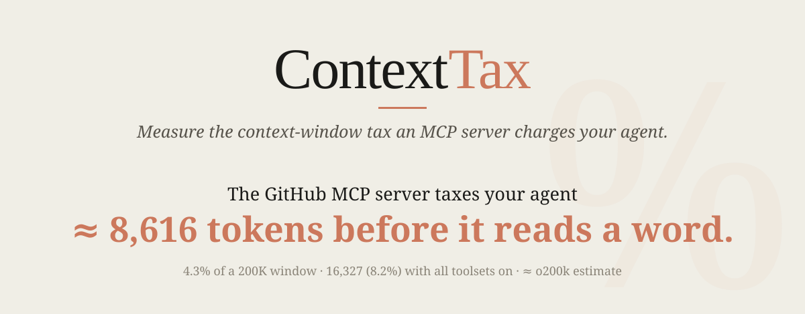
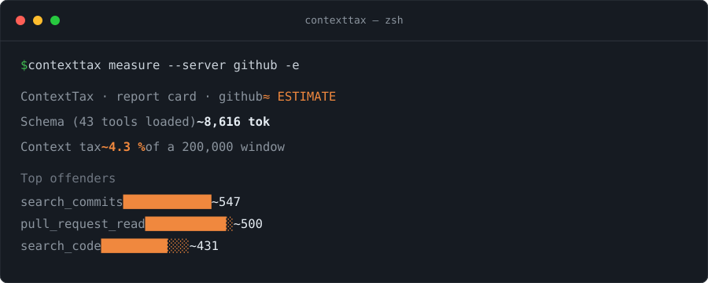

<p align="center">
  <picture>
    <source media="(prefers-color-scheme: dark)" srcset="assets/hero-dark.svg">
    
  </picture>
</p>

<p align="center">
  <a href="https://github.com/PavelTkachenk0/ContextTax/releases/latest"></a>
  <a href="https://github.com/PavelTkachenk0/ContextTax/releases"></a>
  <a href="LICENSE"></a>
  <a href="https://github.com/PavelTkachenk0/ContextTax/actions/workflows/ci.yml"></a>
  
</p>

<p align="center">
  <picture></picture>
</p>

<p align="center">
  <a href="https://github.com/PavelTkachenk0/ContextTax/releases/latest"></a>
</p>

---

## Install

**macOS / Linux**
```sh
curl -fsSL https://github.com/PavelTkachenk0/ContextTax/releases/latest/download/install.sh | sh
```

**Windows (PowerShell)**
```powershell
irm https://github.com/PavelTkachenk0/ContextTax/releases/latest/download/install.ps1 | iex
```

Or download a single-file binary from [Releases](https://github.com/PavelTkachenk0/ContextTax/releases/latest) — **no .NET required**.

> The binaries are unsigned. **macOS:** `xattr -d com.apple.quarantine ./contexttax` (or right-click → Open). **Windows:** "More info → Run anyway".

## Usage

```sh
# Measure a server's schema cost (a live MCP server from your config):
contexttax measure --server github

# Measure a captured tool response — paste it straight in:
pbpaste | contexttax response -e

# Compare a response before/after an optimisation:
contexttax response before.json -d after.json -e

# Measure a whole recorded session (schema + every response):
contexttax session -f run.json -t tools.json -e

# List the MCP servers discovered in your config:
contexttax servers

# No arguments → interactive menu:
contexttax
```

Every command takes **`-e/--estimate`** (keyless, offline o200k_base proxy) or, with `ANTHROPIC_API_KEY` on a funded account, ground-truth `count_tokens`. Add **`--json`** for machine-readable output, **`--window N`** to set the context window, **`-h`** for help.

## Downloads

| Platform | Architecture | File |
|----------|--------------|------|
| macOS | Apple Silicon | `contexttax-osx-arm64` |
| macOS | Intel | `contexttax-osx-x64` |
| Linux | x64 | `contexttax-linux-x64` |
| Windows | x64 | `contexttax-win-x64.exe` |

All binaries are self-contained and single-file — they bundle the .NET runtime, so nothing else is needed.

## Why

A stack of MCP servers can burn **50–200K tokens** of an agent's context window *before the user says a word* — schema bloat up front, then every tool response piling on. ContextTax measures that cost per server in two currencies: **tokens / % of window** and **$ (API)**. The headline metric: *% of context window spent before useful work begins.*

**Two accuracy modes, never mixed up.** With a funded `ANTHROPIC_API_KEY` you get exact `count_tokens` numbers (`✓ ground truth`). Without one, **`-e/--estimate`** gives a keyless o200k_base approximation, loudly labelled `≈` — never presented as ground truth.

## The numbers, reproduced

ContextTax measures real MCP servers with **Anthropic `count_tokens`** (ground truth — Claude's own tokenizer) next to the keyless **o200k_base** estimate, so you see both *and* the gap between them.

| MCP server | Tools | `≈` o200k estimate | `✓` count_tokens | Δ |
|------------|------:|-------------------:|-----------------:|----:|
| Playwright | 23 | ~3,239 | **4,633** (2.3%) | +43% |
| **GitHub** (default toolset) | 43 | ~8,616 | **10,928 (5.5%)** | +27% |
| GitHub (all toolsets) | 82 | ~16,327 | **20,404 (10.2%)** | +25% |
| Azure | 65 | ~16,364 | **18,983 (9.5%)** | +16% |

**The finding:** for these tool schemas the keyless o200k proxy **undercounts Claude by 16–43%** (GitHub: real cost **~27% above** the estimate). It's a proxy, not ground truth — and it cuts both ways: the verbose response in the next section lands ~7% *under* its o200k estimate. Prefer `count_tokens` for any number you cite. <sub>(`count_tokens` · `claude-sonnet-4-5` · 200K window; GitHub measured against `ghcr.io/github/github-mcp-server`, default toolset — deterministic, so you'll get the same numbers.)</sub>

Reproduce — ground truth needs a funded `ANTHROPIC_API_KEY`; add `-e` for the keyless o200k estimate:
```sh
contexttax measure --server github --window 200000        # ✓ count_tokens
contexttax measure --server github --window 200000 -e     # ≈ o200k estimate
```

See the full [**MCP Context-Tax Leaderboard →**](LEADERBOARD.md) (PRs welcome).

## Schemas are only half the tax

Loading a server's tools is the **fixed** cost. The **recurring** cost is every tool *response* — and responses dwarf schemas. ContextTax measures those too (`contexttax response`):

| One tool call | Response tokens (`✓ count_tokens`) | % of a 200K window |
|---------------|-----------------------------------:|-------------------:|
| Playwright `browser_snapshot` of one GitHub page | **38,831** | **19.4%** |

That's **one** `browser_snapshot` — about **8× Playwright's entire 4,633-token schema**, nearly a fifth of your window, on a single call. You load the schema once; responses land on *every* call. Almost nobody measures this:

```sh
contexttax response snapshot.yml                # measure a captured response
pbpaste | contexttax response                   # or paste one straight in
contexttax response before.json -d after.json   # diff an optimisation
```

## "But I heard GitHub MCP is 55K tokens?"

You may have seen GitHub MCP cited at [~42K, or ~55K across 93 tools](https://getunblocked.com/blog/github-mcp-token-cost/) — *"a quarter of your window before you type a word."* Those community numbers raised the alarm, and the direction is right. But they're estimates with **no stated tokenizer or scope** (schemas only? plus server instructions? which version?), and their per-tool breakdowns are explicitly *"illustrative, not precise."*

ContextTax makes it exact:

- **Tokenizer:** Anthropic `count_tokens` — Claude's *own* tokenizer, not an o200k / tiktoken estimate.
- **Scope:** the marginal cost the **tool schemas** add to a request — what you actually pay.
- **Pinned:** a specific `ghcr.io/github/github-mcp-server` version (the toolset grows every release).

The real number for the current server: **10,928 tokens (5.5%)** on the default toolset, **20,404 (10.2%)** with all 82 toolset tools. Lower than 55K — that figure counted more tools with an unstated method — but **precise, version-pinned, and reproducible.** The tax is real; now it has a real number.

## Build from source

```sh
dotnet build
dotnet run --project src/ContextTax.Cli -- measure --tools samples/tools/filesystem.tools.json -e
```

## License

MIT — see [LICENSE](LICENSE).
